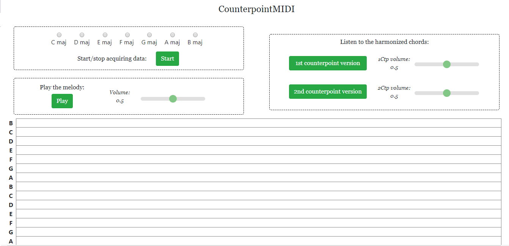
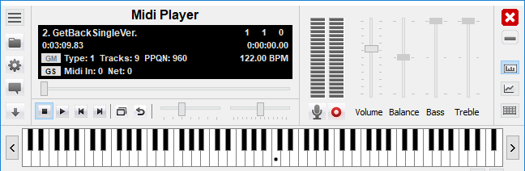
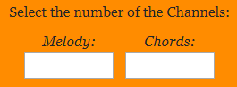
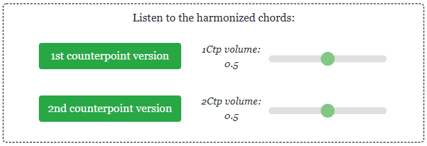
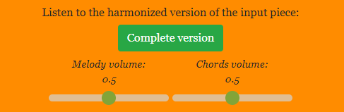

# HarMIDI

  
 
HarMidi is a digital harmonizer of MIDI input tracks, whose work is based on First and Second Species Counterpoint rules. 

### Creators

* Landini Eleonora
* Morato Cecilia

### Main features

* MIDI input recording
* Playing back the input melody
* Chords' generation
* Reconstruction of the song
* Sound Synthesis

### Getting started

To be able to use this application, the user needs:
  * a MIDI Player application, used to transmit the MIDI sequence;
  * a virtual or serial MIDI port, to connect the MIDI transmission to the Web Application

  
 

Before starting the recording, the user has to choose a song in the MIDI Player; then melody’s and chords’ channel numbers have to be selected in the Web Application. 

  
 

### MIDI input recording

1. Click on the button START to begin acquiring the input data (the button will change color and become blue);
1. To start playing the song, click on the button Play in the MIDI Player;
1. To stop recording, click pause in the MIDI Player, and click again on the STOP button.

### Playing back the input melody

Press the button Play to hear the melody. 
The volume can be controlled using the slider next to the button.

  
 

### Chords' generation

The new chords are built following Counterpoint rules; for this application, First and Second Species Counterpoint. 
First Species Counterpoint associates to each note another note of the same duration (1:1 ratio), and these notes must be consonant. 
Therefore, after extracting a sequence of notes belonging to the original chords, the First Species Counterpoint notes are generated by unisons, perfect 5ths, perfect 8ths, major and minor 3rds, major and minor 6ths intervals built up over the former note. 

Second Species Counterpoint associates to each note two other notes, with half the duration of the original one (2:1 ratio). The note on the stressed beat must be consonant, while the note on the unstressed beat can be dissonant. 
Therefore, following the Second Species Counterpoint rules:
* stressed notes are generated by unisons, perfect 5ths, perfect 8ths, major and minor 3rds, major and minor 6ths intervals;
* unstressed notes can be also derived from harmonic dissonant intervals like major and minor 2nds with respect to the original note.

Press the button ‘1st Counterpoint version’ to hear the First Species Ctp chords.
Press the button ‘2nd Counterpoint version’ to hear the Second Species Ctp chords.
Volume of both versions can be controlled by tuning the respective sliders. 

  
 

### Reconstruction of the song

Press the button ‘Complete’ to hear both melody and chords playing together.
Volumes of both melody and generated chords can be controlled using the sliders next to the button. 

  
 

### Sound Synthesis

Sound Synthesis is generated by the Web Audio API. 

* Oscillators:
     * One oscillator controls the reproduction of the melody;
     * Reproduction of chords is controlled by two oscillators, whose gain values are both connected to a constantSourceNode that synchronizes them;
     * One last oscillator controls the reproduction of the Second Species Counterpoint;

* Gain:
     * Each oscillator is connected to a gain node;
     * Each slider in the application is connected to a gain that allows the user to regulate the volume of the reproduction.
     
* Analyser:
     * Each gain node is connected to an analyser node;
     * Each analyser has the purpose to compute the FFT of its input data.
     
* requestAnimationFrame:
     * Recursively called on functions that modify the HTML canvas properties;
     * Allows to plot the frequency spectrum of the output track.
     

  
 

### Notes

* The application works both online and offline
* The code is written in HTML5, CSS and JAVASCRIPT
* The code is available on https://github.com/eleonoraelah/HarMIDI

