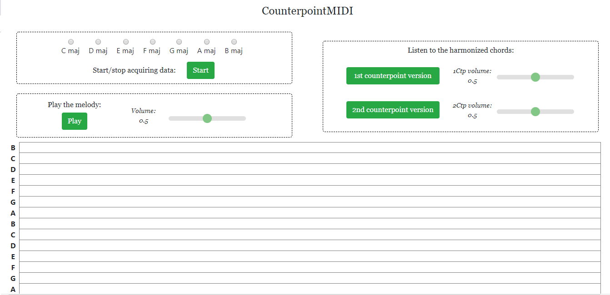
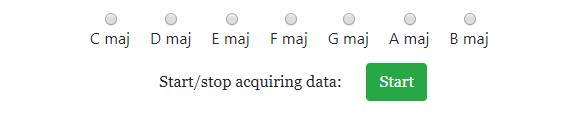
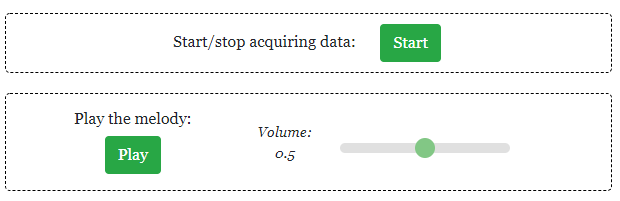
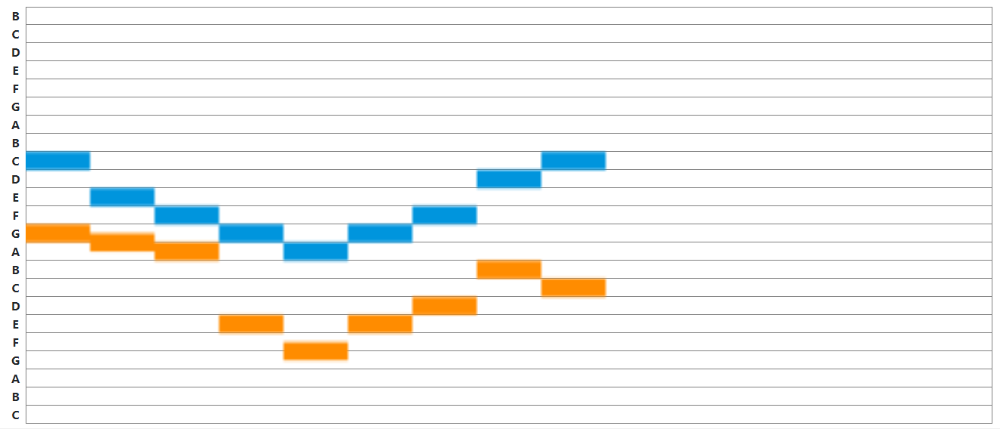
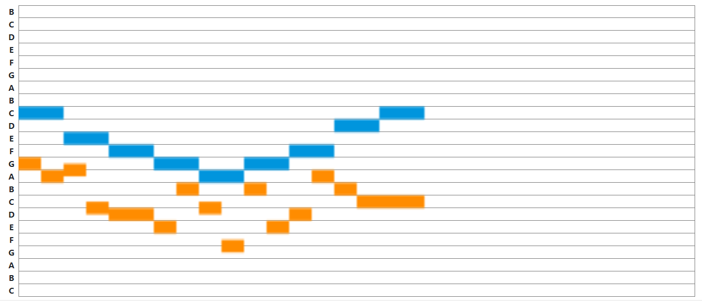

# CounterpointMIDI

  
 
CounterpointMIDI is a web application that creates First and Second Species Counterpoint lines over a Cantus Firmus provided by a MIDI input track transmitted with a serial (or virtual) keyboard.

### Creators

* Landini Eleonora
* Morato Cecilia

### Main features

* MIDI input recording
* Key choice
* Playing back the input melody
* Counterpoint notes generation
* Sound Synthesis
* Notes visualization 

### Getting started

To be able to use this application the user needs to transmit a MIDI sequence via serial or virtual port, therefore the usage of a physical or virtual keyboard is required.

### Key choice

Select the key your Cantus Firmus is in.

  
 

### MIDI input recording

1. Click on the button START to begin acquiring the input data (the button will change color and become blue);
1. Start playing the chosen Cantus Firmus (examples can be found in the "trial CF" folder);
1. To stop recording, click again on the STOP button.

  

### Playing back the input

Press the button Play to hear the Cantus Firmus. 
The volume can be controlled using the slider next to the button.

  
 

### Counterpoint notes generation

The new notes are built following Counterpoint rules; for this application, First and Second Species Counterpoint. 

First Species Counterpoint associates to each note another note of the same duration (1:1 ratio), and these notes must be consonant. 
Therefore, the First Species Counterpoint notes are generated by using unisons, perfect 5ths, perfect 8ths, major 3rds, major 6ths intervals built up over the Cantus Firmus note. 

Second Species Counterpoint associates to each note two other notes, with half the duration of the original one (2:1 ratio). The note on the stressed beat must be consonant, while the note on the unstressed beat can be dissonant. 
Therefore, following the Second Species Counterpoint rules:
* stressed notes are generated by unisons, perfect 5ths, perfect 8ths, major 3rds, major 6ths intervals;
* unstressed notes can be also derived from harmonic dissonant intervals like major 2nds and 4ths with respect to the original note;
* dissonant notes generated can only be:
    ** passing tones, filling the interval of a third;
    ** neighbour notes, moving away from the consonance by a step and then resolving back to the consonance by a step in the opposite direction.

All Counterpoint lines end with a modal cadence built following the rules of the clausola vera.

Press the button ‘1st Counterpoint version’ to hear the First Species Ctp computed sequence.
Press the button ‘2nd Counterpoint version’ to hear the Second Species Ctp generated sequence.
Volume of both versions can be controlled by tuning the respective sliders. 

  
 

### Sound Synthesis

Sound Synthesis is generated by the Web Audio API. 

* Oscillators:
     * One oscillator controls the reproduction of the melody;
     * Reproduction of First Species Counterpoint sequencies is controlled by two oscillators, whose gain values are both connected to a constantSourceNode that synchronizes them;
     * Two last oscillators control the reproduction of the Second Species Counterpoint lines;

* Gain:
     * Each oscillator is connected to a gain node;
     * Each slider in the application is connected to a gain that allows the user to regulate the volume of the reproduction.

### Notes Visualization

with this application is possible to visualize:

* Transmitted notes in real time;
* Cantus Firmus line reproduced with a constant note duration;
* Superposition of Cantus Firmus and First Species Counterpoint notes;

  
 

* Superposition of Cantus Firmus and Second Species Counterpoint notes;

  

### Notes

* The application works both online and offline
* The code is written in HTML5, CSS and JAVASCRIPT
* The code is available on https://github.com/eleonoraelah/CounterpointMIDI
* The Web Application is available on http://counterpointmidi.surge.sh/

